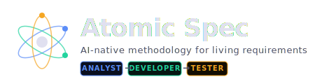

[English](README.md) | **Русский**

<p align="center">
  <a href="https://dab512.github.io/atomic-spec/ru.html">
    
  </a>
</p>

<p align="center">
  <strong>AI-native методология живых требований — один атом, один файл, одна единица знания.</strong>
  <br/>
  <a href="https://dab512.github.io/atomic-spec/ru.html">dab512.github.io/atomic-spec</a>
</p>

Atomic Spec — это **AI-native** методология, которая объединяет **Domain-Driven Design**, **Test-Driven Development**, **Use-Case-Driven** и **Requirements-Driven** подходы в единый поток, оркестрируемый AI-агентами. Каждое требование — живой артефакт с историей, а не замороженный документ.

## Основная идея

Каждое требование живёт в одном файле `*.spec.md` («атоме»), который проходит через три **роли AI-агентов**:

**Агент-Аналитик** (бизнес-намерение) → **Агент-Разработчик** (реализация) → **Агент-Тестировщик** (верификация)

**Агент-Оркестратор** координирует конвейер, переключает роли и валидирует артефакты на каждом **Gate**-чекпойнте. Весь процесс — от декомпозиции задачи до кода и тестов — управляется AI-агентами по строгим контрактам.

## Ключевые принципы

- **AI-native**: три специализированных AI-агента (Аналитик, Разработчик, Тестировщик), управляемых мета-агентом-оркестратором
- **Один атом = один файл = одна единица знания** (`*.spec.md`)
- **Прогрессивное раскрытие**: от бизнес-намерения к тест-кейсам и коду
- **Технологически нейтральное ядро**: сердце атома не зависит от платформы
- **Прослеживаемость**: каждый артефакт ссылается на исходный атом
- **Конвейер агентов на основе контрактов**: каждый агент производит артефакты, валидируемые на гейтах

## Иерархия атомов

```
System (Система)                        <- меняется раз за жизнь продукта
 └── Domain (Ограниченный контекст)     <- меняется при стратегических сдвигах
      └── Use Case (Сценарий использования) <- меняется почти каждый спринт
           └── Scenario (лист)          <- атомарный тест-кейс
```

## Быстрый старт

1. Скопируйте `templates/atom-template.spec.md` в каталог `specs/` вашего проекта
2. Заполните секции Аналитика (Intent, Domain Rules, AC, DMT, Constraints)
3. Пройдите валидацию Gate A
4. Заполните секции Разработчика (Tech Spec, Platform API, Implementation Notes)
5. Пройдите валидацию Gate B
6. Заполните секции Тестировщика (Test Plan, Platform Tests, Coverage Matrix)
7. Пройдите валидацию Gate C

Подробное руководство — в разделе [Быстрый старт](docs/ru/getting-started.md).

## AI-Агент Оркестратор

Atomic Spec создан для выполнения AI-агентами. Включённый **скилл Оркестратора** для [Claude Code](https://claude.ai/claude-code) управляет полным конвейером:

1. **Декомпозирует** задачу на атомы (spec-файлы)
2. **Переключается** между ролями Аналитик → Разработчик → Тестировщик
3. **Валидирует** артефакты на каждом Gate перед передачей следующей роли
4. **Соблюдает** git-конвенции для веток, коммитов и PR

Установите скилл — и ваш AI-агент становится полноценным практиком Atomic Spec. См. [`skill/`](skill/) и [инструкции по установке](skill/README.md).

```
Вы: "Спроектируй фичу регистрации пользователя"

Оркестратор: Декомпозиция → домен AUTH, тип additive
  [РОЛЬ: Аналитик]     → Intent, Domain Rules, AC, Constraints → Gate A ✅
  [РОЛЬ: Разработчик]  → Tech Spec, API, Code                 → Gate B ✅
  [РОЛЬ: Тестировщик]  → Test Plan, Coverage Matrix, Tests     → Gate C ✅
Готово: спек + код + тесты, всё трассируется к атомам.
```

## Документация

| Документ | Описание |
|----------|----------|
| [Быстрый старт](docs/ru/getting-started.md) | Пошаговое руководство по созданию первого атома |
| [Методология](docs/ru/methodology.md) | Полный справочник по методологии |
| [Анатомия атома](docs/ru/atom-anatomy.md) | Структура spec-файла |
| [Роли и конвейер](docs/ru/roles-and-pipeline.md) | Роли Аналитика, Разработчика, Тестировщика |
| [Валидация гейтов](docs/ru/gate-validation.md) | Чек-листы Gate A, B, C |
| [Git-соглашения](docs/ru/git-conventions.md) | Ветвление, коммиты, PR |
| [Типы изменений](docs/ru/change-types.md) | Parameter, Rule, Flow, Model, Boundary |
| [Поправки](docs/ru/amendments.md) | Как обрабатывать изменения в процессе |

## Справочники AI-агентов

Подробные руководства для каждой роли AI-агента:

- [Агент-Аналитик](skill/references/analyst.md) — Intent, Domain Rules, AC, Constraints
- [Агент-Разработчик](skill/references/developer.md) — Tech Spec, API, Code, Implementation Notes
- [Агент-Тестировщик](skill/references/tester.md) — Test Plan, Coverage Matrix, Platform Tests

## Мета-спецификация

Этот репозиторий применяет методологию к самому себе — сама методология описана в формате Atomic Spec в каталоге [`specs/`](specs/). Точка входа — [`specs/system.spec.md`](specs/system.spec.md).

## Структура файлов

```
atomic-spec/
├── README.md
├── README.ru.md
├── LICENSE
├── docs/                        # Документация
│   ├── getting-started.md
│   ├── methodology.md
│   ├── atom-anatomy.md
│   ├── roles-and-pipeline.md
│   ├── gate-validation.md
│   ├── git-conventions.md
│   ├── change-types.md
│   └── amendments.md
├── skill/                       # Скилл для AI-агента (Claude Code)
│   ├── SKILL.md                 # Промпт оркестратора
│   ├── references/              # Справочники по ролям
│   │   ├── analyst.md
│   │   ├── developer.md
│   │   └── tester.md
│   └── assets/
│       └── atom-template.spec.md
├── specs/                       # Мета: Atomic Spec описывает сам себя
│   ├── system.spec.md
│   └── methodology/
│       ├── domain.spec.md
│       ├── _index.md
│       ├── atom-lifecycle/
│       ├── role-pipeline/
│       └── gate-validation/
├── templates/                   # Шаблон атома для ваших проектов
│   └── atom-template.spec.md
└── website/                     # Лендинги (HTML)
    ├── index.html
    └── orchestrator.html
```

## Сайт

Интерактивная документация: **[dab512.github.io/atomic-spec/ru.html](https://dab512.github.io/atomic-spec/ru.html)**

## Тест методологии

> Можете ли вы восстановить полную историю домена — кто, когда и почему принял каждое решение — только по `git log` файлов `*.spec.md`? **Да** → методология применена правильно.

## Лицензия

Лицензия MIT — см. [LICENSE](LICENSE).
